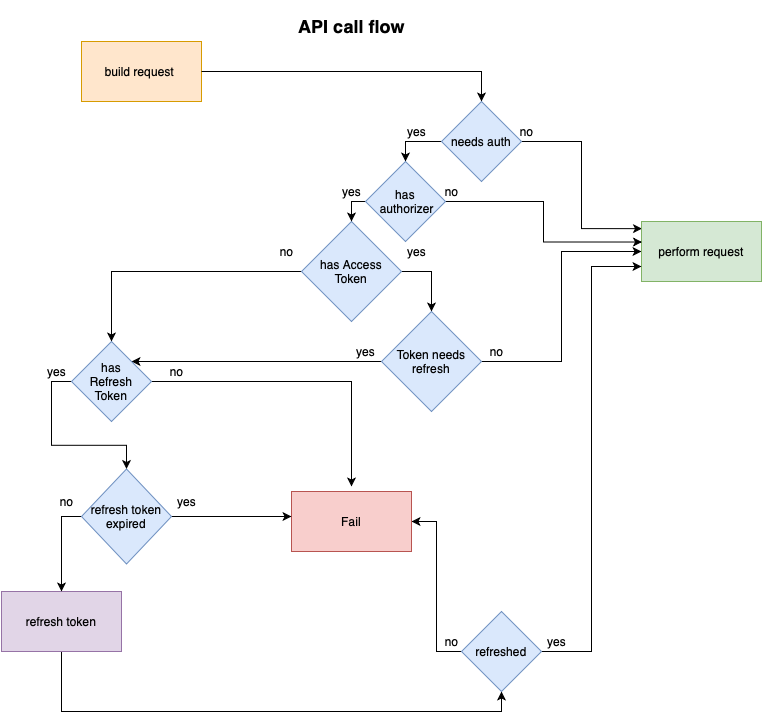

# NetLord

**NetLord** is a swift package specifically for Networking purposes.

### General flow of API call



### Network Manager

`NetworkManager` is responsible for performing provided request. In case it needs an authorization and `NetworkManager` itself has `authorizer`, network manager triggers `authorizer`'s `authorize()` method and only after that it calls actual `perform` method with an authorized request. Same thing applies on `dataTask` and `downloadTask`. 

> Currently `NetworkManager` doesn't contain an `uploadTask`.

You can initialize `NetworkManager` with `URLSession` (**Required**), authorizer(*Optional*) and `decoder`(*Optional*).

```swift
let session = URLSession(configuration: .default)
let authorizer = OAuthManager(service: MyAuthService(), tokenStore: MyTokenStore())
let manager = NetworkManager(session: session, authorizer: authorizer, decoder: JSONDecoder())
```

### Authorizing

`Authorizing` is an abstraction for authorizer containing `isSignedIn` property alongside `authorize()` method.

```Swift
public protocol Authorizing: AnyObject {
    var isSignedIn: Bool { get }
    func authorize() -> AnyPublisher<HTTPHeaders, Error>
}
```

> You can use `OAuthManager` for authorizer or implement your own one.

### OAuthManager

`OAuthManager` is a wrapper of `OAuthService` (composition of two protocols `TokenRetrieving` and `SignInRequestProvider`. First one is used to get token data from code or to refresh an access token and latter one to get a `URLRequest` of authentication for webview.).

You can initialize it with `OAuthService`, `TokenStoring` (abstraction used for handling token persistence) and `Configuration`.

```swift
let oAuthManager = OAuthManager(service: MyAuthService(), tokenStore: MyTokenStore())
```

Also, `OAuthManager` itself conforms to `Authorizing` protocol and handles all the authorization logic.

### TokenStoring

`TokenStoring` is a protocol containing methods for storing, getting and removing tokens in a persistence store. (e.g. Keychain) and is used by `OAuthManager`.

### Endpoint

`Endpoint` is a structure containing request method, path and query items.

### Request Builder

`RequestBuilder` is a builder for `URLRequest`. You can build it by setting scheme, host, base path, endpoint and additional headers.

## Example of API call

```Swift
let session = URLSession(configuration: .default)
let authorizer = OAuthManager(service: MyAuthService(), tokenStore: MyTokenStore())
let manager = NetworkManager(session: session, authorizer: authorizer, decoder: JSONDecoder())

let queries: [URLQueryItem] = [.init(name: "foo", value: "bar")]
let endpoint = Endpoint(path: "my/path", queryItems: queries)
let request = RequestBuilder()
            .setScheme("https")
            .setHost("example.com")
            .setBasePath("/v1")
            .setEndpooint(endpoint)
            .build()
return manager.perform(request: request)
```

